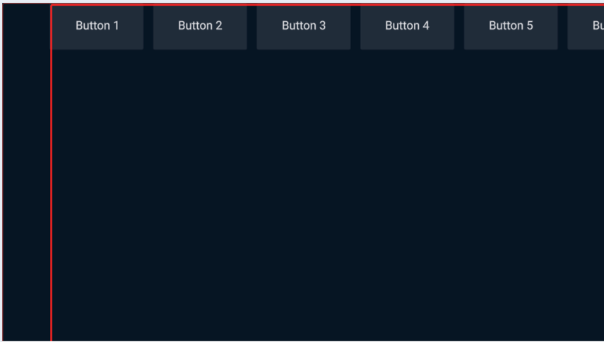
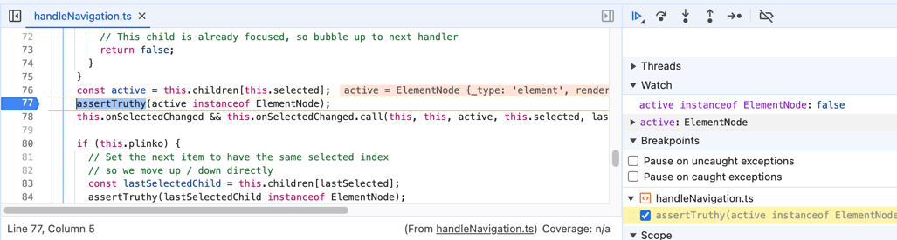

This is a small project trying to replicate/reproduce SolidJS + Lightning.

Currently running into navigation issues.

Despite seemingly copying solid-ui to a T, the focus is applied to outer elements and navigation
throws errors:



```
dev.js:1099 Uncaught Error: Assertion failed
    at assertTruthy (assertTruthy.ts:34:11)
    at ElementNode.onRight (handleNavigation.ts:77:5)
    at propagateKeyDown (focusManager.ts:144:25)
    at handleKeyEvents (focusManager.ts:181:7)
    at focusManager.ts:231:7
    at runUpdates (dev.js:912:17)
    at runWithOwner (dev.js:578:12)
    at HTMLDocument.keyPressHandler (focusManager.ts:230:5)
```

Even though the focused element is ElementNode:


